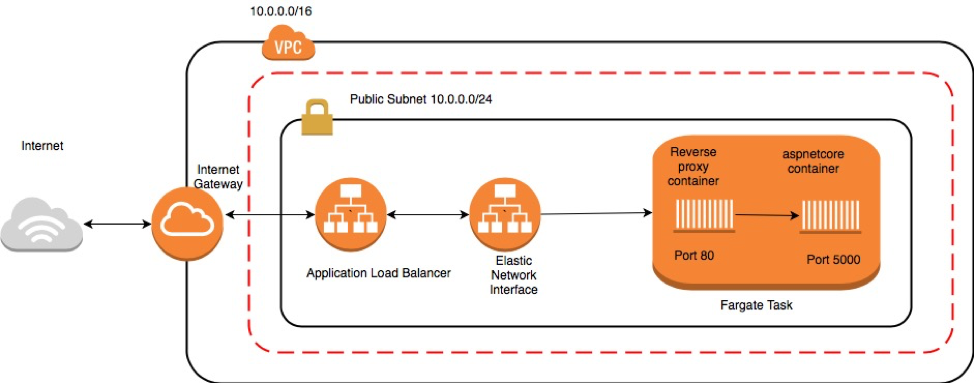
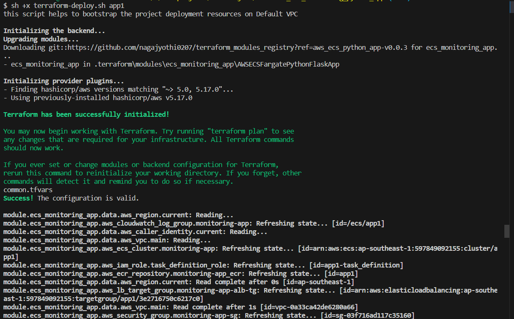
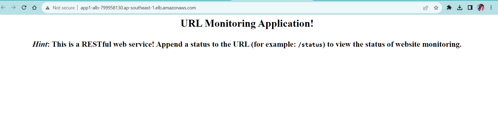
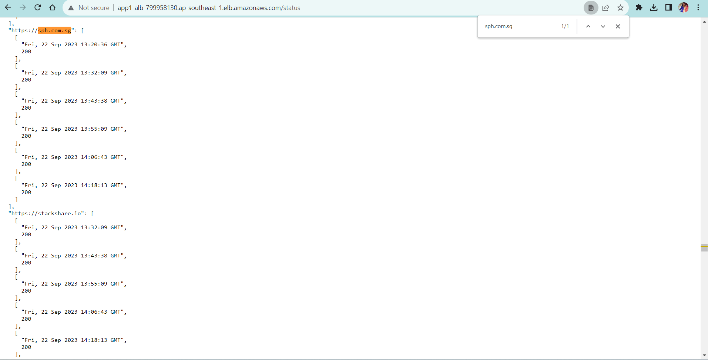

# A Python Application to Monirtor the Website URL's - Containerized application and deploying on AWS ECS Fargate
## Scenario 1 - Terraform, AWS
In this scenario Terraform deploys highly available ECS Fargate Cluster with spreading to 03 AZ's with 02 container tasks for high availablity. The python application will monitor the urls provided in the CSV file. 
If url is not accessable/error it will provide the status of -1. If url is accessable and responded to 200 status code, it will print the success message.

## Architecture Diagram:


## Assumptions:

1) **AWS credentials with admin previlges are configured in your local laptop to provision the resources using terraform**
2) **Updated the `terraform.tfvars` file for project inputs like VPC ID and Subnet Details**

Please refer the IAC deployment configuration in `main.tf` file
By using this terraform stack the below resources will be provisioned to accomodate this architecture design:

## Deployment instructions:
1) **Run the `sh terraform-deploy.sh app1` file for infrastructure and App deployment on the AWS environment. This terraform-deploy script takes care of the getting the Public IP of your network and setting the App name and aws region based on your default profile configuration**
2) **The Monitoring Application will be accessable to given Public IP in the terraform.tfvars**
3) **To view the  website url monitoring status, please click the terraform outputs for ALB Url.**
4) **To view the monitoring url status, please click the terraform monitoring_staus url**

## Execution Screenshot:


## Execustion Results:


## URLs Monitoring Status



## Refer the Networking Stack module if you want to deploy the Custom VPC with subnets.

## Network stack: https://github.com/nagajyothi0207/terraform_modules_registry/tree/main/NetworkStack

```hcl
variable "myip" {
  description = "The public IP of your trusted network to access the Bastion Server"
  default     = ""
}
variable "vpc_cidr" {
  description = "cidr block for VPC creation, e.g 172.31.0.0/16"
  default     = ""
}

module "network_stack" {
  source               = "git::https://github.com/nagajyothi0207/terraform_modules_registry//Network_Stack?ref=aws_vpc_three_tier-v0.0.1"
  vpc_cidr_block       = var.vpc_cidr
  my_public_ip_address = var.myip # Your public IP address to allow SSH Access to the Bastion Host
}

output "vpc_id" {
  value = module.network_stack.vpc_id
}
output "public_subnets" {
  value = module.network_stack.public_subnets
}
output "private_subnets" {
  value = module.network_stack.private_subnets
}
output "private_subnet_ids" {
  value = module.network_stack.private_subnet_ids
}
output "public_subnet_ids" {
  value = module.network_stack.public_subnet_ids
}

output "public_subnet_ids_1" {
  value = module.network_stack.public_subnet_ids[0]
}

```

For more examples, please refer to the examples directory.

## Inputs to this module
1. myip
2. VPC CIDR 

## Resources that created by using this Module:
1) **A VPC with CIDR range of 172.31.0.0/16**
2) **03 Public and Private subnets with NACL's and Route tables**
3) **01 EIP for NAT gateway**
4) **1 Internet gateway**
5) **VPC endpoints for s3 (gateway) and SSM (Interface)**
6) **public and private security groups**


## ---------------------END----------------------------