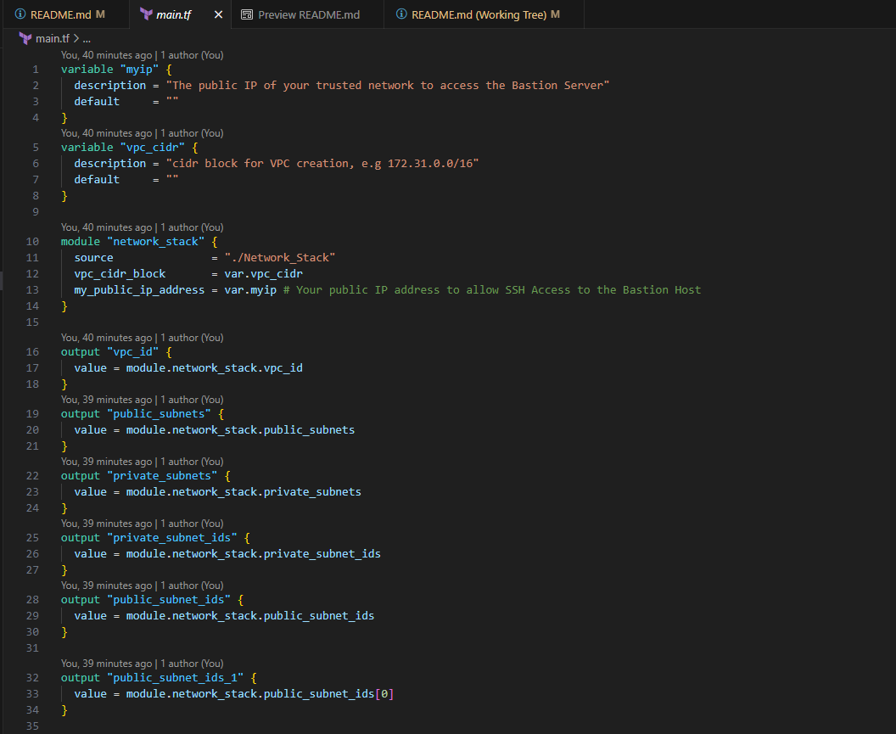

# A Python Application to Monirtor the Website URL's - Containerized application and deploying on AWS ECS Fargate
## Scenario 1 - Terraform, AWS
In this scenario Terraform deploys highly available ECS Fargate Cluster with spreading to 03 AZ's.

## Architecture Diagram:

## Assumptions:

1) **AWS credentials with admin previlges are configured in your local laptop to provision the resources using terraform**
2) **Updated the `terraform.tfvars` file for project inputs like VPC ID and Subnet Details**

Please refer the IAC deployment configuration in `main.tf` file
By using this terraform stack the below resources will be provisioned to accomodate this architecture design:

## Deployment instructions:
1) **Run the `sh terraform-deploy.sh app1` file for infrastructure and App deployment on the AWS environment. This terraform-deploy script takes care of the getting the Public IP of your network and setting the App name and aws region based on your default profile configuration**
2) **The Monitoring Application will be accessable to given Public IP in the terraform.tfvars**
3) **To view the  website url monitoring status, please click the terraform outputs for ALB Url.**
4) **To view the monitoring url status, please click the terraform monitoring_staus url**

## Execution Screenshot:

## Execustion Results:

## URLs Monitoring Status

## Refer the Networking Stack module if you want to deploy the Custom VPC with subnets.
Network stack:

1) **A VPC with CIDR range of 172.31.0.0/16**
2) **03 Public and Private subnets with NACL's and Route tables**
3) **01 EIP for NAT gateway**
4) **1 Internet gateway**
5) **VPC endpoints for s3 (gateway) and SSM (Interface)**
6) **public and private security groups**

## ---------------------END----------------------------